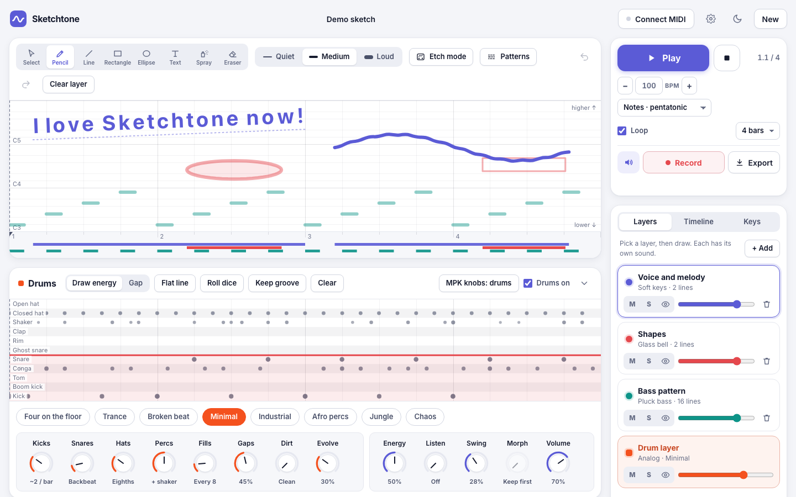

# Sketchtone

**Draw lines, hear music.** Sketchtone turns drawings into sound: left to right is time, higher is a higher note, thicker is louder. It is made for people who are not music producers, and it works with a mouse, a keyboard, a touch screen or a MIDI controller.



**Try it: [sketchtone.netlify.app](https://sketchtone.netlify.app)** · or open the [demo sketch](https://sketchtone.netlify.app/?demo) (it never replaces work you already have).

## What you can do

- **Draw sound** with a Paint-style toolbox: pencil, line, rectangle, ellipse, spray and eraser. Shapes play chords, spray plays short sparkles.
- **Sing with text.** The Text brush types words on the canvas and a robot voice sings them, autotuned to the scale, following the slope of the words.
- **Shape any line** with eight knobs always at hand under the toolbar (time offset, transpose, wave cycles and depth, time and pitch stretch, slope, volume). With nothing selected they set the defaults for new lines. Time snap (1/4, 1/8, 1/16) keeps rhythms tight; a ruler and a position readout show bar, beat and note; pick the root key for every scale. Box-select several lines (Shift-click to add) and drag side handles to stretch them in time or pitch. The **Notes** view shows a layer as notes on a grid, with Quantize.
- **Generate patterns** when you don't want to draw (press G): repeat a motif across the loop (rows for chords, climb for arpeggios, brick for off-beats), or start from presets like Arpeggio, Heartbeat or Bouncing ball.
- **Generative drums.** Draw an energy line, turn eight knobs (kicks, snares, hats, percs, fills, gaps, dirt, evolve) and the drummer writes the groove, with fills and drop-outs that change every phrase. **Freeze** it to fix the hits, then click to add or remove hits, Shift-click for louder, Alt-click for "sometimes".
- **Shape the sound** on every layer with knobs (click a value to type it exactly): 22 presets plus your own saved sounds and drum kits, source, envelope, 19 effects and voice effects. The drums are a layer too, with their own kits and effects.
- **Play live.** Edits change the sound while it plays. Read modes reverse, ping-pong or slice the loop.
- **Plug in a controller.** Tuned for the Akai MPK Mini: knobs reshape lines, pads jump to slices, keys hold effect presets (with a default for every key, locked to the beat or the bar so they never land out of time), the joystick bends pitch.
- **Mix** in the Mix tab: volume, pan, mute, solo and a live meter per layer and for the drums, plus a master meter with a clip light.
- **Keep and share your work.** The sketch saves itself in the browser. Save versions, download a project file, record live, export a WAV of any length (rendered offline with a fade-out), **stems** (one WAV per layer and drums, in a .zip) or a **MIDI file** for any DAW.

## Run it

It is plain HTML, CSS and JavaScript, with no build step and no dependencies.

```bash
python3 -m http.server 5178
```

Then open http://localhost:5178. Opening `index.html` directly from the disk works too. MIDI needs Chrome or Edge.

## Keyboard

Press **?** in the app for the full list. The essentials:

| Keys | Action |
| --- | --- |
| Space | Play or pause (also on the canvas) |
| Home | Stop all sound, back to the start |
| Enter | Start or finish a line with the keyboard |
| Q | Time snap: off, 1/16, 1/8, 1/4 |
| C | Metronome |
| V P L R O T S E | Select, Pencil, Line, Rectangle, Ellipse, Text, Spray, Eraser |
| G | Patterns |
| [ ] | Quieter or louder lines |
| Alt + arrows | Nudge the selected line |
| Ctrl/⌘ C, V, D | Copy, paste, duplicate the selected line |
| Ctrl/⌘ Z, Shift Ctrl/⌘ Z | Undo, redo |
| 1 … 8, D | Pick a layer, the drum layer |
| M, Shift S | Mute, solo the picked layer |
| + − | Faster, slower |
| Ctrl/⌘ S, Ctrl/⌘ E, Ctrl/⌘ , | Save a version, export, settings |

Every control has a label for screen readers, knobs behave as sliders, and changes are announced.

## Privacy

Everything stays in your browser: no account, no cookies, no analytics, no third parties. Fonts are served by the site itself, and a strict Content-Security-Policy blocks any other host. Exports and recordings are made on your computer. See the Privacy page in the app's settings for details.

## How it is built

| File | What it does |
| --- | --- |
| `js/app.js` | Interface, canvas, tools, knobs, settings and export |
| `js/audio.js` | Web Audio engine: voices, effects buses, live edits, offline WAV export |
| `js/shapes.js` | Tools and item geometry, non-destructive transforms |
| `js/patterns.js` | Pattern generator and line presets |
| `js/voice.js` | Robot singing voice: letters to phonemes to formant filters |
| `js/drums.js` | Generative drummer and synthesized kits |
| `js/fx.js` | The 19 effects |
| `js/sounds.js` | Presets, scales and panel definitions |
| `js/midi.js` | Web MIDI input, knob mapping and setup |
| `js/knob.js` | Accessible rotary knob |

## Deploy

The repository includes `netlify.toml`: connect the repository to Netlify and it publishes the app as is. Only `index.html`, `styles.css`, `js/` and `fonts/` go online.

## Credits

Idea and design by Alessio Marcone. Built with [Claude Code](https://claude.com/claude-code). All sounds are synthesized live with the Web Audio API. Type: [Inter](https://rsms.me/inter/) by Rasmus Andersson, included under the SIL Open Font License (`fonts/Inter-LICENSE.txt`).

## License

[MIT](LICENSE) © 2026 Alessio Marcone
